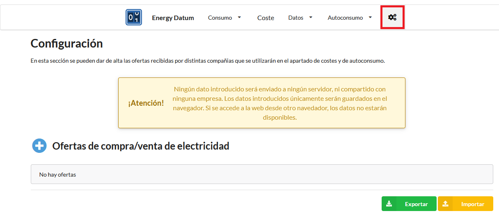
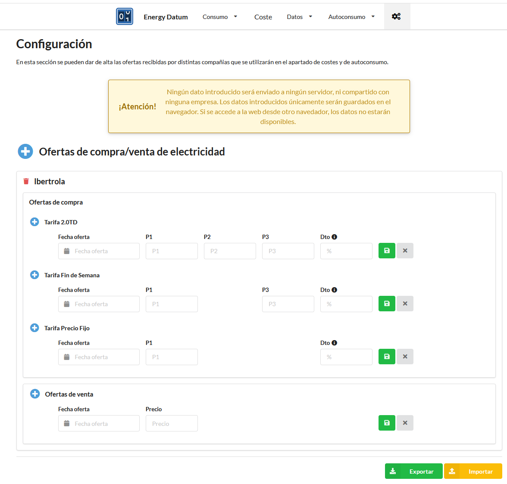

# Energy Datum

**Energy Datum** es un generador de un sitio web estático que permite visualizar de diferentes maneras el consumo de energía de tu hogar. Nada mejor que verlo para hacerse una idea:

:sparkles: [Ver demo](https://diegocastroviadero.com/energydatum) :sparkles:

El propósito inicial del proyecto era poder responder, desde un punto de vista económico, a las preguntas:

- ¿Me interesa poner paneles solares en mi casa?
- ¿Cuánto tiempo voy a tardar en amortizar la inversión?

Ya había utilizado algún simulador online, pero no me fiaba de los resultados.

Además, en el camino me han ido surgiendo otro tipo de preguntas que también he considerado interesante responder:

- ¿Tengo la tarifa que mejor se adapta a mis hábitos de consumo?
- ¿Me interesa más una tarifa de 3 tramos, de fin de semana o de precio fijo?
- ¿Me interesa más el mercado regulado o el mercado libre?
- ¿Cuánto habria pagado en el mercado regulado por el consumo de mi último año?
- Si la empresa X me ofrece unas condiciones ¿Cuánto habría pagado si hubiera tenido esas condiciones durante el último año?
- ¿Consumo más energía por la mañana o por la tarde-noche?
- ¿Consumo más energía los fines de semana?

Actualmente el proyecto se encuentra en una versión *alpha*. Todavía no se responde a la pregunta que dió origen al proyecto, pero sí al resto.

Si te interesa tener respuesta a alguna de estas preguntas, [¡Anímate!](#me-gusta-qué-hago-para-tenerlo)

### Contexto de desarrollo

Para los curiosos que echen un ojo al código, he de hacer unas explicaciones sobre el contexto en el que he desarrollado del proyecto. Este proyecto ha sido desarrollado casi íntegramente durante mi permiso de paternidad, mientras estaba yo solo al cargo de mi hija, aprovechando sus siestas. Las siestas de mi hija conmigo, siempre son en la mochila de porteo, y casi siempre con una mano sujetando su cabeza. Así que échale imaginación: de pie (¡Bendito *standing desk*!), cargando con más de 6kg, balanceándome contínuamente (y normalmente tarareando algo) y sólo con una mano disponible para escribir.

Soy consciente de que el código no es muy bonito de ver, no es nada consistente, hay duplicidades, etc. He primado que sea funcional lo antes posible (¿Recuerdas la pregunta que quiero responder? No quiero que pase de este verano para tomar una decisión). Más adelante, si hay tiempo y ganas, se puede refactorizar. O mejor aún, [¡Hazme una PR con tus mejoras!](https://github.com/dicastro/energydatum/pulls) 

Dicho esto, espero que seas algo más considerado antes de emitir un juicio :wink:.

### Funcionamiento

Una vez descargado y configurado el proyecto ([ver instrucciones aquí](#me-gusta-qué-hago-para-tenerlo)), el funcionamiento es sencillo: te descargas  de tu distribuidora eléctrica las lecturas del contador, ejecutas un script, y subes los cambios a GitHub. ¡Y ya está! Gracias a *GitHub Pages* tendrás tu sitio web accesible en `https://<TU_USUARIO_GITHUB>.github.io/energydatum/`. 

He intentado complicarme lo menos posible con la tecnología para que sea fácil de usar y desplegar.

### Stack tecnológico

Aún siendo un desarrollador Java, he preferido utilizar [Python](https://www.python.org) debido a la variedad de librerías que existen para procesamiento de datos (pyspark, pandas, numpy, etc.).

> He usado la versión 3.9 de Python, porque he tenido un problema con python 3.10, PySpark, Pandas, el PyCharm (2021.3.2) en modo debug. Al crear un DataFrame de PySpark, a partir de otro DataFrame de Pandas, que ha sido creado leyendo de un fichero json, PySpark acaba llamando al método `to_records` del DataFrame de Pandas. Esto provoca un error de `NoneType is not callable`. Parece ser (por lo que he leído [aquí](https://www.reddit.com/r/learnpython/comments/shztvw/pandas_dfto_records_error_typeerror_nonetype/)) que esto se debe a un problema con Python 3.10 y al ejecutar en debug en PyCharm. Al pasar a Python 3.9.12, se soluciona el problema.

Aún siendo una cantidad reducida de datos, he decidido utilizar [PySpark](https://spark.apache.org/docs/latest/api/python) porque su sintaxis me parece muy intuitiva, quizás esté influenciado por mi background sql. Creo que [Pandas](https://pandas.pydata.org) habría encajado mejor y los tiempos de ejecución (dado el volumen de datos) serían considerablemente más bajos, de hecho hice un intento de usarlo, pero finalmente desistí, sentía que no avanzaba a un ritmo adecuado (dado el [contexto](#contexto-de-desarrollo) mencionado anteriormente). Para lo único que uso pandas es para la lectura/escritura de ficheros.

Para la representación de los datos utilizo [Plotly](https://plotly.com), que es una librería python de visualización de datos que permite generar gráficos interactivos de forma muy sencilla y exportarlos en html.

Para la renderización del contenido he optado por html, usando [Fomantic UI](https://fomantic-ui.com) para darle una apariencia algo *"resultona"*. Desconocía fomantic ui, es un fork de *semantic ui*, y lo descubrí gracias a [DataTables](https://datatables.net/manual/index), una librería javascript para la visualización de tablas. También he utilizado [Jinja](https://palletsprojects.com/p/jinja), otra librería python, como motor de templates html y así poder tener una plantilla base con la estructura común a todas las páginas del sitio.

Para implementar cierto dinamismo en las páginas he optado por el clásico [JQuery](https://jquery.com), que me parece muy sencillo de usar (*fácil y sencillo, para toda la familia*).

Por último, mencionar el uso de [Dataframe JS](https://gmousse.gitbooks.io/dataframe-js/content/doc/api/dataframe.html), que es una librería javascript del estilo a *pandas*, permitiéndome hacer ciertos cálculos de forma dinámica.

### Orígenes de datos

| Origen                                                                                                                                                      | Descripción                                                        |
|-------------------------------------------------------------------------------------------------------------------------------------------------------------|--------------------------------------------------------------------|
| [API E-SIOS](https://api.esios.ree.es)                                                                                                                      | Precio de la electricidad                                          |
| [Datos Madrid - Calendario Laboral](https://datos.madrid.es/egob/catalogo/300082-0-calendario_laboral.csv)                                                  | Festivos nacionales                                                |
| [Iberdrola Distribución](https://www.i-de.es)                                                                                                               | Consumo eléctrico por horas                                        |
| [PVGIS](https://joint-research-centre.ec.europa.eu/pvgis-photovoltaic-geographical-information-system/getting-started-pvgis/api-non-interactive-service_en) | Radiación solar en un sitio con estimación de producción eléctrica |

# Me gusta, ¿Qué hago para tenerlo?

### ¿Es tu primera vez?

1. Verifica que cumples con los [requisitos](#requisitos)
1. Haz un fork del [repo](https://github.com/dicastro/energydatum)
    - Y si le das 1 :star: ¡Genial!
1. Configura *GitHub Pages* en tu repo, sobre la rama `main` y la carpeta `docs`
1. Clona tu repo
1. Revisa y adapta el fichero de configuración `config.toml`
1. Añade los datos de las lecturas de tu contador en la capeta `import/consumptions`
    - Una vez procesados se mueven automáticamente a `import/consumptions/processed`
1. Crea un fichero `.env` en la raíz del repo (ver ejemplo justo debajo)
1. Ejecuta el script `run.cmd`
    - ¡Ten paciencia! La primera vez tardará un rato
1. Haz push de los cambios
1. ¡Ya está!
    - En unos pocos minutos tendrás tu propio sitio *Energy Datum* disponible en `https://<TU_USUARIO_GITHUB>.github.io/energydatum/`

Este es contenido que tienes que anadir en el fichero `.env`:

```env
JAVA_HOME=<JDK_PATH>
SPARK_HOME=<SPARK_PATH>
HADOOP_HOME=<SPARK_PATH>
PYSPARK_PYTHON=<PYTHON_PATH>\python.exe
ESIOS_TOKEN=<TOKEN_ESIOS>
PATH=%PATH%;%HADOOP_HOME%\bin
```

> Este fichero no debería publicarse nunca en GitHub, porque contiene información sensible. Ya está añadido en el `.gitignore`, así que en principio no hay de qué preocuparse. 

#### ¿Qué es el token E-SIOS?

[E-SIOS](https://api.esios.ree.es) es una API de REE (Red Eléctrica de España) que permite acceder, entre otros, a los precios de la electricidad en el mercado regulado. Para poder utilizar esta API hay que solicitar un token. La solicitud es sencilla, se envía un email y, en mi caso, en 24h ya tenía el token.

<a href="mailto:consultasios@ree.es?subject=Personal token request">Solicitar Token E-SIOS</a>

### ¿Quieres actualizar tu propio sitio *Energy Datum*?

¡Más fácil aún!

1. Añade nuevos datos de las lecturas de tu contador en la capeta `import/consumptions`
1. Ejecuta el script `run.cmd`
1. Haz push de los cambios
1. ¡Y listo!
    - Hay que ser un poco paciente y darle tiempo a GitHub para que procese los cambios
    - Recuerda que tu sitio *Energy Datum* estará disponible en `https://<TU_USUARIO_GITHUB>.github.io/energydatum/`

### ¿Quires ver el resultado en local?

Una vez ejecutado el script `run.cmd`, ejecuta el script `server.cmd`. Tendrás el sitio web accesible en [http://localhost:80808/energydatum/](http://localhost:80808/energydatum/).

### ¿Y si tengo linux/mac?

Seguro que echando un ojo a los scripts `run.cmd` y `server.cmd` no te cuesta mucho crear unos equivalentes en shell script. Si es el caso, [¡Hazme una PR!](https://github.com/dicastro/energydatum/pulls) :wink:

# Formato de los datos

No sé si hay un estándar en el formato de los datos de las lecturas de los contadores. Yo vivo en la Comunidad de Madrid y mi distribuidora es [Iberdrola Distribución](https://www.i-de.es). En el caso de esta distribuidora, los datos se descargan en formato `csv` y tienen la siguiente estructura:

```csv
CUPS;Fecha;Hora;Consumo_kWh;Metodo_obtencion
<NUMERO_CUPS>;02/06/2020;1;0,275;R
<NUMERO_CUPS>;02/06/2020;2;0,255;R
<NUMERO_CUPS>;02/06/2020;3;0,284;R
<NUMERO_CUPS>;02/06/2020;4;0,293;R
```

Si tienes otra distribuidora y los datos los tienes en otro formato, por el momento tendrás que transformarlos manualmente en el formato anterior. Puedes abrirme un [issue](https://github.com/dicastro/energydatum/issues) y comentarme en qué otro formato tienes los datos para ver si se podría adaptar el código de forma sencilla y soportar ambos.

> Tengo pendiente investigar [Datadis](https://datadis.es), que es una plataforma que centraliza los datos de todas las distribuidoras y además expone un API para poder descargar los datos de forma automática. Desconozco si funciona bien, si tiene todos los datos, la frecuencia de actualización, estabilidad del servicio, etc.

Si la primera vez tienes muchos datos y tu distribuidora no te deja exportarlos de una vez en un único fichero, como ocurre con iberdrola distribución (como máximo te deja exportar 12 meses), no hay problema. En la carpeta `import/consumptions` puedes depositar tantos ficheros como desees.

Se asume que en una ejecución, los datos de las lecturas no tienen duplicados entre sí. Lo que sí se tiene en cuenta, es que podría haber duplicados con los datos procesados en una ejecución anterior. En este caso, prevalecen los últimos en ser procesados.

# Requisitos

### Hardware

Disponer de un contardor de la luz *"smart"* y tener acceso a sus lecturas.

### Software

Necesitarás tener instalado:

> ¡OJO! Actualmente soy usuario de Windows, así que todas las recomendaciones/comentarios van orientadas a ese SO.

- Java 11 (¿Java? Sí, diría que pyspark lo acaba usando por debajo)
    - Te recomiendo la [JDK de Azul](https://www.azul.com/downloads/?package=jdk), ya que permite descargar un fichero comprimido sin instalar nada en el sistema
- Python 3.9.12
    - En algún otro punto ya he mencionado los problemas que tuve con Python 3.10
- [Spark 3.2.1](https://www.apache.org/dyn/closer.lua/spark/spark-3.2.1/spark-3.2.1-bin-hadoop3.2.tgz)
    - Descargar y descomprimir
- [Winutils 3.2](https://github.com/kontext-tech/winutils)
    - Descargar `winutils.exe` y `hadoop.dll`, y depositarlos en la carpeta `bin` de Spark

> Estas son las versiones que tengo yo, no digo que sean las únicas con las que funcione

Además tendrás que definir la variable de entorno `PYTHONHOME`, apuntando a la ruta donde hayas instalado python. Y modificar la variable de entorno `PATH` para incluir `%PYTHONHOME%` y `%PYTHONHOME%\Scripts`.

# Manual de usuario de *Energy Datum*

Este es el menú principal del sitio:


### Consumo

En la opción de menú *Consumo* se disponen de distintas vistas sobre el consumo eléctrico:


La opción *Día semana* muestra el consumo eléctrico (consumo medio diario y consumo acumulado diario) según el día de la semana, el mes del año y el año. Aquí se un ejemplo del consumo diario medio:


La opción *Periodo* muestra el consumo eléctrico según los periodos (tramos) de diferentes tarifas (2.0TD, fin de semana y precio fijo). A continuación se muestra un ejemplo de cómo se distribuiría el consumo con una tarifa de 3 periodos. Se puede ver el consumo acumulado de cada uno de los periodos (tramos) de la tarifa en cuestión para los últimos 12 meses. También se puede ver el % que representa cada uno de los periodos con respecto al total.


Pulsando en el icono de *información*, a la izquierda de cada tarifa, se puede ver el detalle de las horas en las que aplica cada uno de los periodos. Ejemplo para la tarifa 2.0TD:


La opción *Diario* permite mostrar el consumo de días concretos. Inicialmente no se muestra nada:


Seleccionando un día del calendario y pulsando en el botón '+', se mostrará el consumo del día seleccionado en la gráfica


Pudiendo añadir más de un día al mismo tiempo:


### Configuración



En esta pantalla se pueden confirurar las ofertas recibidas de diferentes compañías comercializadoras. Estas ofertas son las que se utilizan en el apartado de *costes* (explicado más abajo) para hacer una comparativa del coste de la energía consumida.

Esta configuración **se guarda en el propio navegador**, por lo que si se cambia de navegador o de disposito habrá que volver a introducir la configuración. Existe la opción de exportar la configuración, para evitar tener que volver a introducirla manualmente. También existe la posibilidad de importar la configuración a partir de una URL. Es por esto que he incluido una [copia de la configuración](https://github.com/dicastro/energydatum/blob/main/site_configuration_backup.json) en el repositorio de GitHub, y así poder importarla fácilmente desde cualquier dispositivo. 

Existe la posibilidad de introducir los precios finales (habiendo aplicado todos los descuentos) o bien introducir los precios en bruto e indicar el descuento que se tiene. Si se tuvieran varios descuentos (como por ejemplo en mi caso con *TotalEnergies*), se pueden indicar de la siguiente forma: `dto1 > dto2` (ejemplo: `5 > 35`, ya que no es lo mismo un 40% que primero un 5% y luego un 35%).



Es recomendable que se metan los precios **sin IVA**, ya que en el apartado de *costes* se hace una comparativa con PVPC (mercado regulado), y estos costes vienen sin IVA.

También se muede marcar la oferta que tenemos en uso actualmente. Esto permite mostrarla en el apartado de *Precios PVPC* (explicado más abajo) y ver cómo evoluciona el precio regulado con respecto a los precios que tenemos actualmente.


¿Tienes otro tipo de tarifa? Te animo a [abrir un issue](https://github.com/dicastro/energydatum/issues). O mejor aún, [¡Impleméntalo y haz una PR!](https://github.com/dicastro/energydatum/pulls)

### Coste


> Los nombres de las ofertas tienen la estructura: compañía + tipo tarifa + fecha oferta

> fix: tarifa de precio fijo | wk: tarifa de fin de semana | 20td: tarifa de 3 tramos

En esta sección se muestra una comparativa de los costes de la energía consumida. En la comparativa se incluye siempre el coste de PVPC, además de las ofertas confuradas en el apartado de configuración.

Para el caso de PVPC, este coste es **sin IVA**, por lo que, tal y como se ha mencionado anteriormente, es recomendable intruducir los precios de las ofertas sin IVA, para que la comparativa tenga  sentido.

En este apartado únicamente se tienen en cuenta los últimos 12 meses con datos. En la imagen se muestran 11, porque la tarifa 2.0TD fue creada un junio del 2021, y en la fecha en la que se hizo la captura de patalla (mayo del 2022, con datos de abril 2021) aún no había 12 meses de datos.

Hasta diciembre del 2021 tuve *HolaLuz*, y me anunciaron un cambio de precios a partir de enero del 2022, que son los que se ven en morado. A principios de enero del 2022 me cambié a TotalEnergies (tarifa fin de semana - wk), ¡Y menos mal!. En su momento no había desarrollado *Energy Datum* y me hice un excel guarro para decidir la tarifa. Con *Energy Datum* habría sido todo más sencillo. Tenía mis dudas entre la tarifa de 3 tramos, la de fin de senana o la de precio fijo. Por lo que ve, dados mis hábitos, poco habrían variado las facturas. He de decir que siempre hemos tenido tarifas con alguna discrinación horaria y estamos habituados a hacer uso de algunos electrodomésticos cuando más nos interesa.

No lo he mencionado hasta ahora, pero todos los gráficos son interactivos: al pasar el ratón por encima se puede ver más detalle, se puede hacr zoom, etc.


### Datos

En esta opción de menú se puede acceder a diversos datos utilizados en múltiples partes del sitio:


- Se puede consultar el listado de días festivos nacionales, utilizados para los cálculos de consumos por periodos
- Se puede consultar la lista de indicadores de E-SIOS, el API de REE, utilizado para obtener los precios de PVPC

Y también se puede ver la evolución del precio de PVPC, categorizando los precios según los tramos de cada tipo de tarifa. A continuación se muestra un ejemplo de la evolución de precios PVPC categorizados según los periodos de la tarifa de fin de semana (2 tramos). Como esta tarifa es la que tengo marcada en la configuración como 'en uso', me aparece la linea de puntos de referencia.


> Se aprecia que el precio que tengo está claramente por debajo del PVPC. Por el momento ¿Cuánto durará? No me importa mucho ya que no tengo ningún tipo de permanencia.

En estas gráficas se muestra tanto el precio medio (línea) como la desviación estándar (franja de color más claro que la línea). Si se hace zoom se aprecia mejor:


# Roadmap

:checkered_flag: Versión 1.0.0.alpha1

- [x] Visualización del consumo por año
- [x] Visualización del consumo por mes
- [x] Visualización del consumo por día de la semana
- [x] Visualización del consumo por hora del día
- [x] Visualización del consumo por periodo
- [x] Visualización del consumo por día del año
- [x] Visualización del coste de la energía consumida en los últimos 12 meses
- [x] Pantalla de configuración para poder configurar las ofertas recibidas de las comercializadoras
- [x] Visualización de la evolución del precio PVPC
- [x] Visualización de los festivos nacionales
- [x] Visualización de los indicadores de E-SIOS

:checkered_flag: Versión 1.0.0.alpha2

- [x] Posibilidad de importar la configuración de una URL (para cargarla directamente desde el GitHub)
- [x] Se añade fichero de configuración en formato *TOML* para indicar el usuario de github y el nombre del fichero que contiene el backup de la configuración, para así poder construir la URL de descarga

:checkered_flag: Versión 1.0.0.alpha2b

- [x] Corregidas URLs de recursos estáticos en sección *Indicadores E-SIOS*
- [x] Se fuerza el modo *Desktop View* para dispositivos móviles

:rocket: Versión 1.0.0.alpha3

- [ ] Visualización de estimación de energía generada por horas. Se hace uso de [PVGIS](https://joint-research-centre.ec.europa.eu/pvgis-photovoltaic-geographical-information-system/pvgis-tools/monthly-radiation_en). Se añade variable de entorno con las coordenadas geográficas. Añadir al fichero de configuración propiedades para indicar la potencia instalada, orientación, y demás datos necesarios para la estimación.

:rocket: Versión 1.0.0.alpha4

- [ ] Añadir en la pantalla de configuración la posibilidad de añadir ofertas de compra de electricidad
- [ ] La sección Precios PVPC, dividirla en 2 subsecciones: compra y venta
- [ ] Visualización del consumo teniendo en cuenta la producción. Se podrá ver la energía sobrante y la que se acaba comprando a la comercializadora. Esto se hará para 12 meses.

:rocket: versión 1.0.0.beta1

- [ ] Visualización del coste con autoconsumo y comparación sin él

:rocket: versión 1.0.0.beta2

- [ ] Visualización del plan de amortización

:rocket: versión 1.0.0 :rainbow:

- [ ] Añadir sección de consejos sobre la instalación de paneles solares [video](https://www.youtube.com/watch?v=r7jrPXTYED4). Listado de marcas de *TIER 1*. Listado de marcas de inversores.
- [ ] Validar los precios con facturas reales

# Backlog

Algunas ideas que se me van ocurriendo y que todavía no he planificado (ni sé si algún día se planificarán)

- Añadir filtro por columnas a las tablas
- Registro en Datadis y probar que funciona
  - Es un servicio transversal a todas las distribuidoras eléctricas que permite recuperar el consumo eléctrico (de esta forma no habría que descargar los consumos manualmente)
- Añadir una sección al menú de *Datos* con el histórico del clima
    - Probar: https://worldweatheronline.com/developer/api/docs/historical-weather-api.aspx
- Añadir al fichero de configuración
  - propiedad para deshabilitar la recuperación de los precios
  - propiedad para deshabilitar la recuperación de la generación eléctrica
  - propiedad para deshabilitar la recuperación del histórico del clima

# Otros Links

- [Manejo de Plotly con JS](https://plotly.com/javascript/plotlyjs-function-reference/#plotlynewplot)
